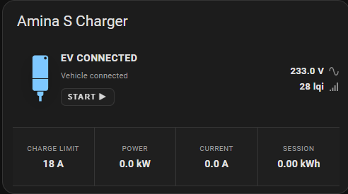
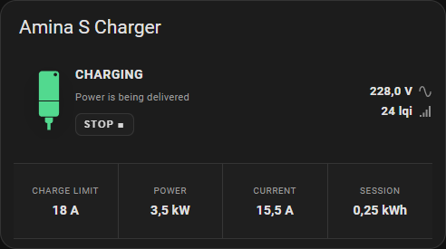
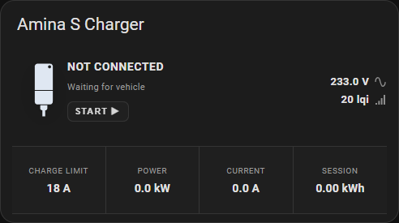
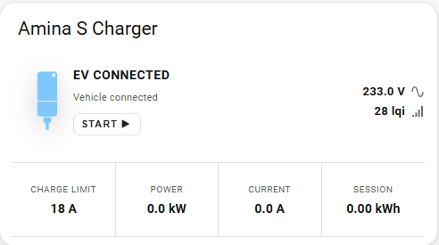
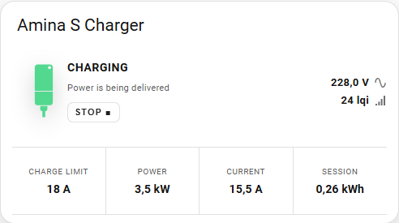
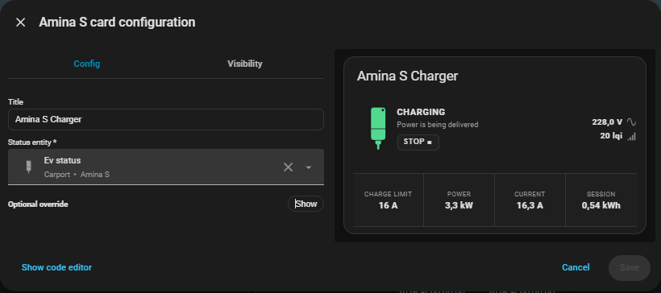
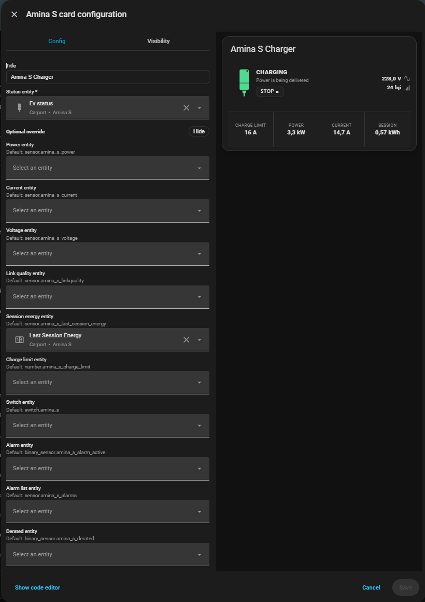

# Amina S Card

A compact Home Assistant Lovelace card for Amina S EV chargers exposed through Zigbee2MQTT. It shows the charger status, LED state, voltage, link quality, charge limit, power, current, and the last charging-session energy.

The card uses the real Amina S entities exposed by Home Assistant. It does not require template sensors or helper entities.

## Installation

### HACS

1. Open **HACS** in Home Assistant.
2. Open **Frontend**.
3. Search for **Amina S Card** and select **Download**.
4. Refresh the browser when Home Assistant asks you to.
5. Add the card from the Lovelace card picker, or configure it in YAML.

HACS registers the JavaScript resource automatically.

### Manual installation

1. Download `dist/amina-s-card.js` from the repository.
2. Copy it to Home Assistant's `/config/www/amina-s-card/` directory.
3. Add it as a Lovelace resource:

```yaml
url: /local/amina-s-card/amina-s-card.js
type: module
```

Then add the card to a dashboard.

## Configuration

Only `status_entity` is required. The card derives the related entity IDs from its name. For example, `sensor.amina_s_ev_status` derives the Amina S entities using the `amina_s` base name.

```yaml
type: custom:amina-s-card
status_entity: sensor.amina_s_ev_status
```

The visual editor includes optional overrides for installations where an entity has a different name. The available override filters follow the entity metadata exposed by Home Assistant:

- Power, current, voltage, and energy use sensor device classes.
- Link quality uses the sensor with the `lqi` unit.
- Charge limit uses a `number` entity.
- Charger control uses a `switch` entity.
- Alarm state and derated state use binary sensors.
- The alarm list uses a sensor entity.

The status entity is the source of truth for charging and EV connection status. Separate connected and charging entities are not required.

## Three-phase charging

This card has currently only been tested with single-phase charging. Three-phase charging has not yet been validated, so the way aggregate power, current, voltage, and session energy are represented may require adjustment.

The card currently displays the selected entities directly. It does not calculate a sum across phase-specific entities. If your Zigbee2MQTT device exposes separate phase entities, use the optional overrides to select the appropriate aggregate entities where available, and treat phase-specific display as experimental until tested.

## Screenshots

The screenshots below show the card in dark and light Home Assistant themes.

### Dark theme

| Connected | Charging | Not connected |
| --- | --- | --- |
|  |  |  |

### Light theme

| Connected | Charging |
| --- | --- |
|  |  |

### Configuration editor

The card editor keeps the status entity required and groups manually assigned entities under optional overrides.

| Required configuration | Optional overrides |
| --- | --- |
|  |  |

## Development

```sh
npm install
npm run build
```

The production bundle is written to `dist/amina-s-card.js`.

## License

This project is released under the MIT License. See [LICENSE](LICENSE).
