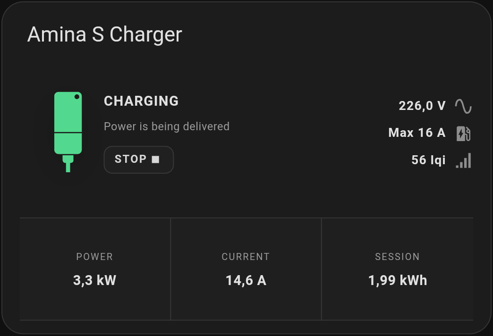
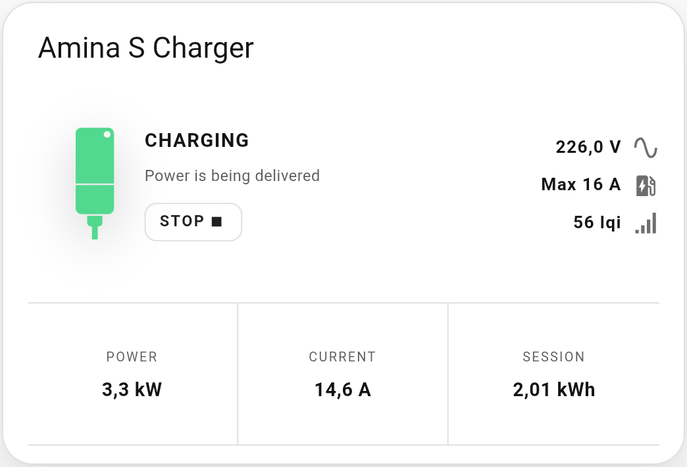

# Amina S Card

A compact Home Assistant dashboard card for Amina S EV chargers using Zigbee2MQTT or ZHA with the [Amina S quirk](https://github.com/attaxia/amina_s_zha_quirk). It shows status, voltage, link quality, charge limit, total power, current, and last-session energy. No template sensors or helpers are needed.

Verified with both integrations and multiple chargers using separate cards. Three-phase display is experimental pending live testing.

## Installation

### HACS custom repository

The card is not yet listed in HACS. Add it manually as a custom repository:

1. Open **HACS**, then open the **⋮** menu and select **Custom repositories**.
2. Enter `https://github.com/bkflatekvaal/ha-amina-s-card` as the repository URL.
3. Select **Dashboard** as the type and click **Add**.
4. Find **Amina S Card** in HACS and select **Download**.
5. Refresh Home Assistant, then add **Amina S Card** from the dashboard card picker.

See [HACS custom repository instructions](https://www.hacs.xyz/docs/faq/custom_repositories/) for more detail.

### Manual file installation

Copy [dist/amina-s-card.js](dist/amina-s-card.js) to `/config/www/amina-s-card/amina-s-card.js` and add this dashboard resource:

```yaml
url: /local/amina-s-card/amina-s-card.js
type: module
```

## Setup

Select the charger's EV status entity in the visual editor, or use YAML:

```yaml
type: custom:amina-s-card
status_entity: sensor.amina_s_ev_status
```

- The heading defaults to the device name. Clear an existing **Title** override to use it.
- The card detects ZHA or MQTT and chooses entity defaults. Unknown integrations use MQTT names. Use **Optional override** for different entity IDs.
- For ZHA, install the quirk, recreate/check entity IDs, and update the card's selection. See [ZHA setup](docs/zha-setup.md).
- Enable LQI/link quality manually for both integrations. Its row is hidden when disabled or absent. Missing numeric readings show `-`.

## Screenshots

| Dark | Light |
| --- | --- |
|  |  |

See [all screenshots](docs/screenshots.md) for other states and the configuration editor. Screenshots illustrate appearance; readings and headings depend on your setup.

## Documentation

- [Configuration and entity defaults](docs/configuration.md)
- [ZHA setup](docs/zha-setup.md)
- [Power and phase telemetry](docs/phase-telemetry.md)
- [More frequent energy updates using helpers](docs/live-energy.md)
- [Changelog](changelog.md)

## Development

```sh
npm install
npm test
npx tsc --noEmit
npm run build
```

The production bundle is written to `dist/amina-s-card.js`.

## License

[MIT](LICENSE).
