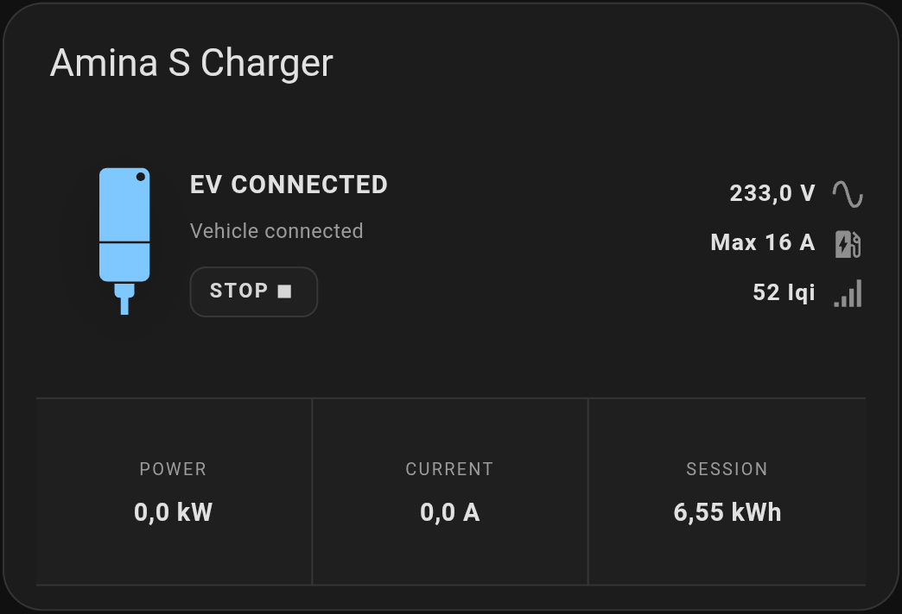
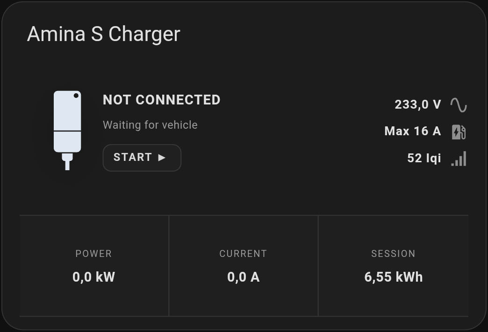
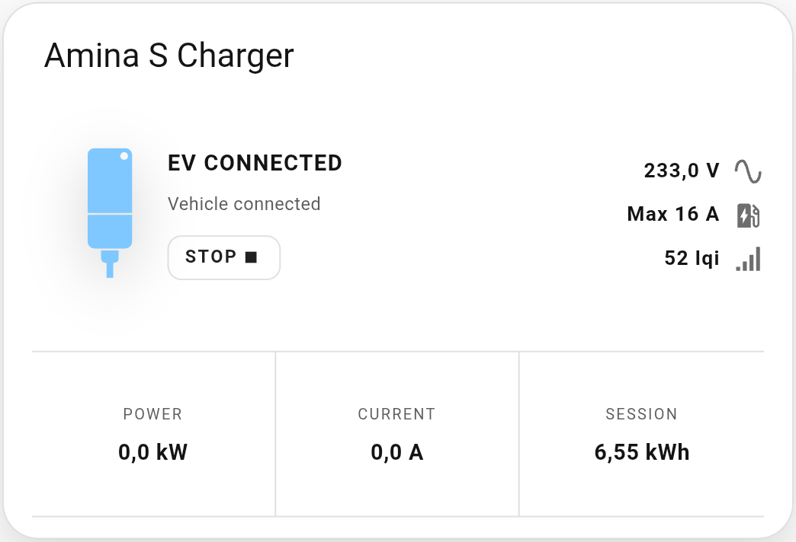
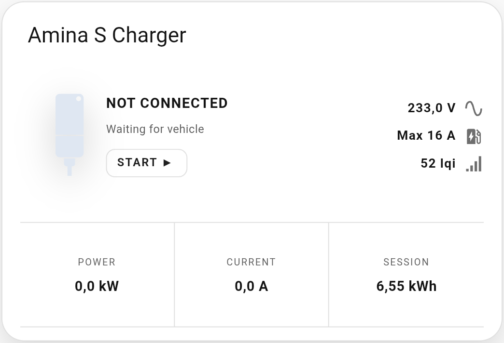
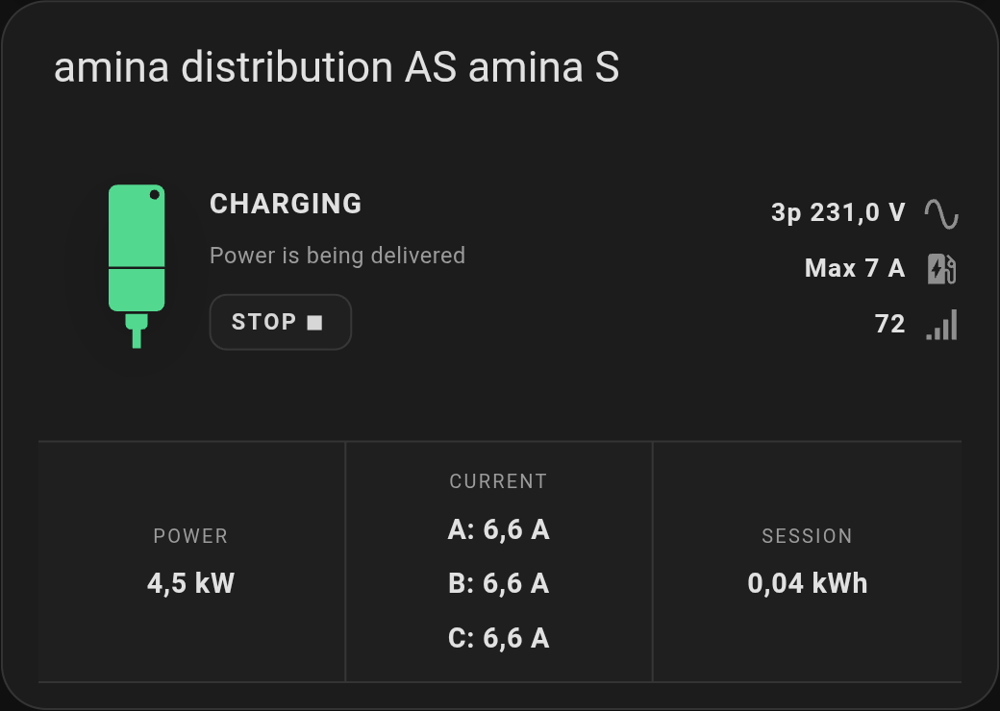
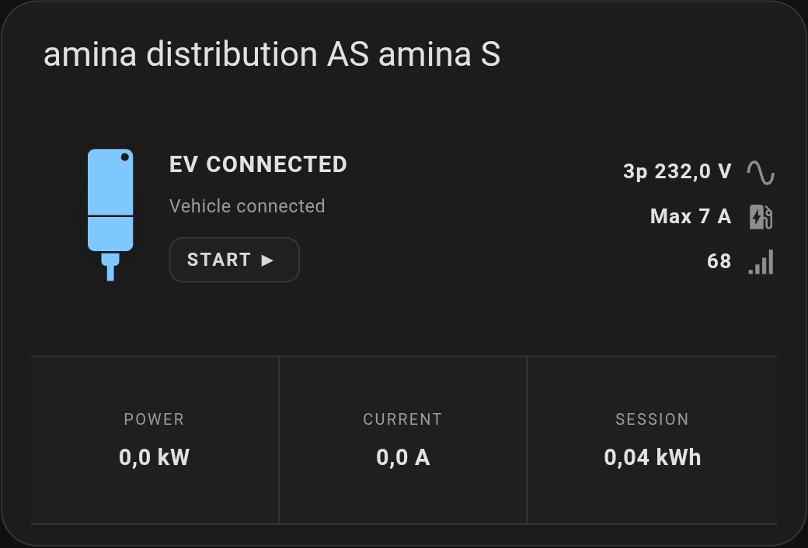
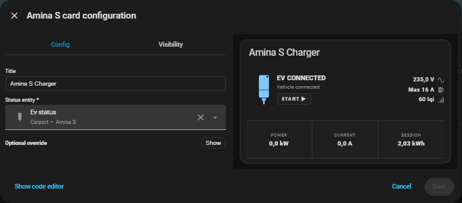
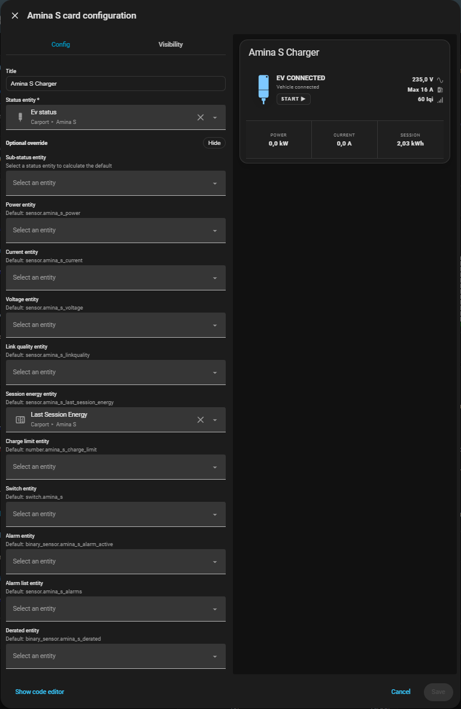

## Screenshots

The screenshots below show the card in dark and light Home Assistant themes.

### Dark theme

| Connected | Charging | Not connected |
| --- | --- | --- |
|  |  |  |

### Light theme

| Connected | Charging | Not connected |
| --- | --- | --- |
|  |  |  |

### Three-phase telemetry

Captured in Home Assistant on 10 October 2026. Charging shows individual A/B/C currents and averaged voltage with the `3p` prefix. When the EV is connected without charging, the card shows the main current and retains `3p` voltage when all three phase voltages are available.

| Three-phase charging | EV connected |
| --- | --- |
|  |  |

### Configuration editor

The card editor keeps the status entity required and groups manually assigned entities under optional overrides.

| Required configuration | Optional overrides |
| --- | --- |
|  |  |

